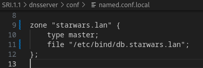
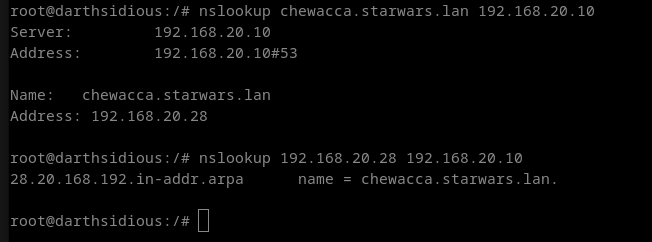

# Instalación de zonas secundarias.

### 1.Tomaremos a máquina darthsidious, e configuraremola para ser servidor secundario, tanto da zona primaria de resolución directa como de resolución inversa. Captura os ficheiros de configuración en ambalas dúas máquinas. Fai unha captura onde se vexa o reinicio da máquina darthsidious, no que se vexa no log dos dous equipos e que se fixo a transferencia de zona.
named.conf.local del dns primario:

OJO: Es mejor poner todo con ruta relativa, sin el /etc/bind, y luego crear los archivos de resolución directa e inversa en /var/cache/bind . En el primario en este caso no afecta, pero en el secundario no nos crearía el archivo de copia de zona porque no tendría permisos. En cambio, en /var/cache/bind sí los tiene.

named.conf.local del dns secundario:

Reinicio dns secundario darthsidious:

cd /var/cache/bind para ver los ficheros que cogió el dns secundario del primario. Lo guarda en formato binario por eso se ve extraño.

### 2.Engade un rexistro tipo A (Chewbacca 192.168.0.28) na zona de resolución directa e tamén na de resolución inversa.  Fai unha captura no momento do reinicio do equipo darthvader, no que se vexa o log dos dous equipos e que se amose que se fixo a transferencia de zona. Adxunta tamén unha captura do ficheiro de zona no servidor secundario.

Cuando hacemos un cambio en dns primario (en el secundario no tocamos), tenemos que aumentar el serial, y es cuando notifica, comprueba ese serial y si es mayor comienza la transferencia de la zona actualizada.

Es importante modificar tanto zona inversa como directa, en caso de que haya cambios.

dig axfr starwars.lan  nos permite comprobar que recibió la zona el servidor secundario. Si configuramos el dns para esa máquina, no es necesario especificarle al final la ip de quien le preguntamos, sino tendríamos que escribirlo así : dig axfr starwars.lan 192.168.20.10

Si configuramos 2 dns para la misma máquina, SOLO preguntará al segundo cuando el primero esté caído.

en /var/cache/bind se guarda la copia de la zona, que la saca del primario.

Para reiniciar el servidor bind, /etc/init.d/named restart
### 3.Comproba que o servidor secundario pode resolver ese nome.

Facemos a comprobación:

### 4.Fai os cambios necesarios para que as trasferencias se fagan de forma segura empregando chaves.  Repite as capturas e vídeos do punto 2, engadindo o rexistro r2d2 (192.168.0.29)

Usaremos las llaves TSIG: https://manuais.iessanclemente.net/index.php/Servidor_DNS_bind#Chaves_TSIG

### 5. Pega nesta tarefa o enlace ao teu repo de github

https://github.com/Ramonsa23/SRI-1.1

- git status
- git add .
- git commit -m "Commit 2"
- git push origin main

OJO: Todos los dns secundarios que piden nuevazona, reciben, sin filtrar quien es ni nada. Si no tienen registro NS, no reciben notificaciones,
a no ser que añadamos en el primario also-notify {192.168.20.x}

Por defecto, deja a todos, pero si añadimos en el primario allow-transfer{192.168.20.x} podemos añadir una lista de dnssecundarios que queramos añadir.

